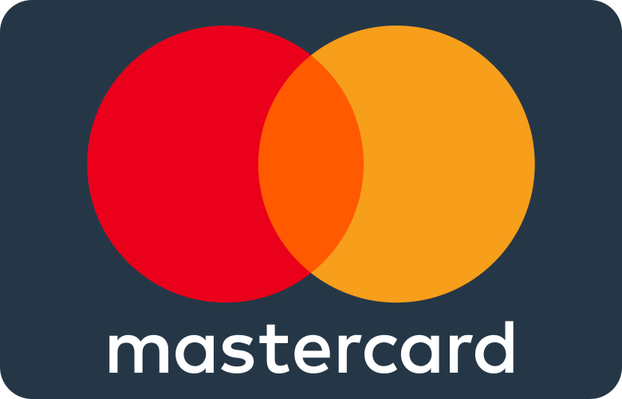

<div align="center">
   <h1 style="display: inline-block; vertical-align: middle; font-size: 32px; font-weight: bold;">
    Stori Card Challenge
  </h1>
  <span style="display: inline-block; vertical-align: middle;">
    
  </span>
</div>

#### This project is an application that processes a CSV file of debit and credit transactions, stores the data in a PostgreSQL database and sends a summary by email. It is developed in Go and uses Docker to run it.

## Prerequisites
* Docker: Make sure you have Docker installed on your system.

## Configuration 
1. Clone this repository to your local machine.
2. Create a .env file in the env directory with the following environment variables
```sh
POSTGRES_USER=your_username
POSTGRES_PASSWORD=your_password
POSTGRES_DATABASE=your_database
SMTP_HOST=your_smtp_host
SMTP_PORT=your_smtp_port
SMTP_USERNAME=your_smtp_username=your_smtp_user
SMTP_PASSWORD=your_password_smtp
SMTP_FROM=your_remitter_email
```
Replace the values with your own configuration.

3. Place your CSV file of transactions in the project root with the name ``` transactions.csv ```

## Execution
1. Open a terminal in the project root.
2. Run the following command to build and start the services defined in the ``` docker-compose.yml ``` file:
```sh
docker-compose up --build
```
This will build the Docker images and start the containers.

3. Once the services are running, you can send a POST with ```To:example@email.com``` in body and request to the ```/process-email``` endpoint to process the transactions and send the summary email. You can use a tool like cURL to send the request:
```sh
curl -X POST -H "Content-Type: application/json" -d '{"To":"example@email.com"}' http://localhost:4004/process-email
```
* This will trigger the processing of transactions, saving to the database, and sending the email.
4. Check your inbox of the email specified in the body to see the transaction summary.

## Stopping the Application
To stop the application and services, press ```Ctrl+C``` in the terminal where docker-compose up is running. Then, run the following command to stop and remove the containers:
```sh
docker-compose down
```

## Project Structure
```sh
stori-card-challenge/
    ├── README.md
    ├── cmd/
    │   └── main.go
    ├── docker-compose.yml
    ├── readme.md
    ├── env-example
    ├── .gitignore
    ├── go.mod
    ├── go.sum
    ├── assets/
    │   ├── mastecard.svg
    │   └── challenge.pdf
    ├── handler/
    │   └── handler.go
    ├── internal/
    │   ├── config/
    │   │   └── config.go
    │   ├── database/
    │   │   └── database.go
    │   ├── email/
    │   │   ├── email.go
    │   │   └── Template/
    │   │       ├── styles.css
    │   │       ├── logo.png
    │   │       └── template.html
    │   ├── file/
    │   │   └── file.go
    │   └── transaction/
    │       └── transaction.go
    └── transactions.csv
```
* README.md: Project documentation file.
* cmd: Directory containing the main application file.
  * main.go: Main application file.
* config: Directory containing the application configuration.
  * config.go: File for loading the application configuration.
* database: Directory containing the database interaction.
  * database.go: File for interacting with the PostgreSQL database.
* docker-compose.yml: Configuration file for defining services and their interaction in Docker.
* email: Directory containing files related to sending emails.
  * email.go: File for sending emails with the transaction summary.
  *  logo.png: Logo image file used in the email.
  *  styles.css: CSS styles file for the email.
  *  template.html: HTML template file for the email.
* env: Directory containing environment configuration files.
* env.example: Example file for environment variables.
* file: Directory containing CSV file reading.
  * file.go: File for reading the CSV file of transactions.
* go.mod and go.sum: Go dependency management files.
* transaction: Directory containing transaction processing.
  * transaction.go: File for processing transactions and generating the summary.

## Additional Considerations
* Ensure you have the correct credentials to access your SMTP server and send emails.
* If you want to change the port on which the application runs, modify the PORT environment variable in the .env file and update the port mapping in the docker-compose.yml file.
* The CSV file of transactions should have the appropriate format, with the columns "Date" and "Amount". You can refer to the example transactions.csv file for reference.
* If you want to use Gmail as your SMTP server(```smtp.gmail.com```) complete the following steps:
  1. Enable 2FA on your Google account. This step is not required, but it is highly recommended.
  2. Generate an app password, as described in [this article](https://support.google.com/accounts/answer/185833). If you don't have 2FA enabled, this step may not be required.
  3. Use the following variables in the .env file:
      1. `SMTP_HOST=smtp.gmail.com`
      2. `SMTP_PORT=587`
      3. `SMTP_USERNAME=your_email@gmail.com`
      4. `SMTP_PASSWORD="abcd efgh ijkl mnop"` This is an app password, follow the steps of Google Account Help Article.
      5. `SMTP_FROM="Your Name <your_email@gmail.com>"`

### If you have any questions or issues, feel free to open an issue in this repository.

